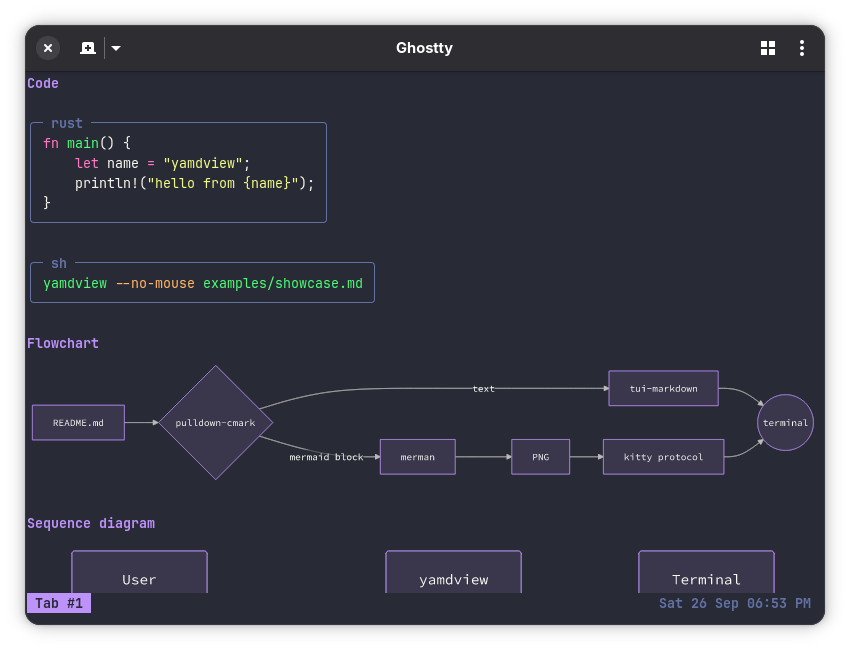
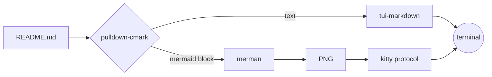

# yamdview

[](https://github.com/jordandelbar/yamdview/actions/workflows/ci.yml)

A terminal markdown viewer that draws mermaid diagrams as images.



It redraws whenever the file is saved, so it fits in a split next to your
editor. [merman](https://github.com/Latias94/merman) renders the diagrams
locally, and the kitty graphics protocol puts them on screen in Ghostty or
kitty. In other terminals, diagrams show as their mermaid source instead.

## Why another markdown viewer

There are _many_ markdown viewers. I looked for one that is a real TUI, works
inside tmux, and draws mermaid diagrams as actual images. I didn't find one, so
I wrote yamdview.

|                                           | Interactive TUI                                   | Live reload | Mermaid   | Inside tmux       |
| ----------------------------------------- | ------------------------------------------------- | ----------- | --------- | ----------------- |
| [mdcat](https://github.com/BIRSAx2/mdcat) | No, it prints; paging and `--watch` don't combine | Yes         | Images    | Images don't show |
| [veol](https://github.com/guiwohl/veol)   | Yes                                               | Yes         | ASCII art | Yes               |
| yamdview                                  | Yes                                               | Yes         | Images    | Yes               |

ASCII diagrams are fine for small graphs, but they fall apart once a diagram
grows. Images usually fail inside tmux because tmux doesn't know they're
there: the next redraw, scroll or pane switch wipes them. yamdview uses kitty's
Unicode placeholders instead, which attach each image to ordinary text cells.
tmux moves those cells like any other text, so the diagrams scroll and redraw
with the pane.

## Install

Download a binary from the
[latest release](https://github.com/jordandelbar/yamdview/releases/latest)
(Linux x86_64, static, or macOS on Apple silicon), or build it:

```sh
cargo install --locked --git https://github.com/jordandelbar/yamdview
```

Nix users can try it without installing anything. Without a file argument it
opens the `README.md` in the current directory:

```sh
nix run github:jordandelbar/yamdview
```

To install it from a flake-based config, add the input:

```nix
inputs.yamdview = {
  url = "github:jordandelbar/yamdview";
  inputs.nixpkgs.follows = "nixpkgs";
};
```

Then add the package in a home-manager module, with `inputs` passed through
`extraSpecialArgs`. For NixOS, use `environment.systemPackages` and
`specialArgs` instead.

```nix
home.packages = [ inputs.yamdview.packages.${pkgs.stdenv.hostPlatform.system}.default ];
```

`nix flake update yamdview` picks up new versions.

That builds yamdview from source. To skip compiling, point an input at the
prebuilt release binary instead:

```nix
inputs.yamdview-bin = {
  url = "file+https://github.com/jordandelbar/yamdview/releases/download/v0.3.0/yamdview-x86_64-linux"; # x-release-please-version
  flake = false;
};
```

```nix
home.packages = [
  (pkgs.runCommand "yamdview" { meta.mainProgram = "yamdview"; } ''
    install -Dm755 ${inputs.yamdview-bin} $out/bin/yamdview
  '')
];
```

The Linux binary is static, so it runs as is. On macOS, use
`yamdview-aarch64-darwin`. Keep the version in the URL: a `releases/latest`
URL serves new content at the same address, which breaks the locked hash once
the old download is garbage collected. To upgrade, change the version, then
run `nix flake update yamdview-bin`.

## Usage

From a clone of this repository, open the showcase, which has every supported
element and diagram type:

```sh
yamdview examples/showcase.md    # or: cargo run -- examples/showcase.md
```

It reads from a pipe too: `gh pr view 12 | yamdview`.

`yamdview --print notes.md` prints the whole document, diagrams included,
so you can scroll and copy it with tmux copy mode.

With no file, it opens `README.md`. [docs/usage.md](docs/usage.md) covers
keys, search, mouse selection, tmux setup and themes.

## How it works



## Development

`nix develop`, or `direnv allow`, gives you a shell with the Rust toolchain
and every tool the git hooks use. Run `lefthook install` once to enable them.
CI runs the same hooks before the tests.
