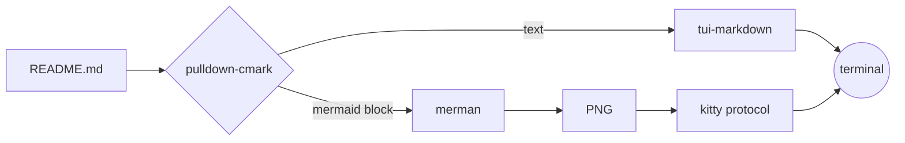

# yamdview

[](https://github.com/jordandelbar/yamdview/actions/workflows/ci.yml)

A terminal markdown viewer that draws mermaid diagrams as images.


It redraws whenever the file is saved, so it fits in a split next to your
editor. Diagrams are rendered locally with
[merman](https://github.com/Latias94/merman) and shown through the kitty
graphics protocol, which Ghostty, kitty and WezTerm support.

## Install

Download a binary from the
[latest release](https://github.com/jordandelbar/yamdview/releases/latest)
(Linux x86_64, static, or macOS on Apple silicon), or build it:

```sh
cargo install --locked --git https://github.com/jordandelbar/yamdview
```

With Nix, try it without installing. With no file argument, it opens the
`README.md` in the current directory:

```sh
nix run github:jordandelbar/yamdview
```

To install it from a flake-based config, add the input:

```nix
inputs.yamdview = {
  url = "github:jordandelbar/yamdview";
  inputs.nixpkgs.follows = "nixpkgs";
};
```

Then add the package in a home-manager module, with `inputs` passed through
`extraSpecialArgs`. For NixOS, use `environment.systemPackages` and
`specialArgs` instead.

```nix
home.packages = [ inputs.yamdview.packages.${pkgs.stdenv.hostPlatform.system}.default ];
```

`nix flake update yamdview` picks up new versions.

That builds yamdview from source. To install the prebuilt release binary
instead, so nothing compiles, point an input at the release file:

```nix
inputs.yamdview-bin = {
  url = "file+https://github.com/jordandelbar/yamdview/releases/download/v0.2.0/yamdview-x86_64-linux"; # x-release-please-version
  flake = false;
};
```

```nix
home.packages = [
  (pkgs.runCommand "yamdview" { meta.mainProgram = "yamdview"; } ''
    install -Dm755 ${inputs.yamdview-bin} $out/bin/yamdview
  '')
];
```

The Linux binary is static, so it runs as is. On macOS, use
`yamdview-aarch64-darwin`. Keep the version in the URL: a `releases/latest`
URL serves new content at the same address, which breaks the locked hash once
the old download is garbage collected. To upgrade, change the version, then
run `nix flake update yamdview-bin`.

## Usage

From a clone of this repository, open the showcase, which has every supported
element and diagram type:

```sh
yamdview examples/showcase.md    # or: cargo run -- examples/showcase.md
```

With no file, it opens `README.md`. Keys, search, mouse selection, tmux setup
and themes are covered in [docs/usage.md](docs/usage.md).

## How it works



## Development

`nix develop`, or `direnv allow`, gives you a shell with the Rust toolchain
and every tool the git hooks use. Run `lefthook install` once to enable them.
CI runs the same hooks before the tests.
