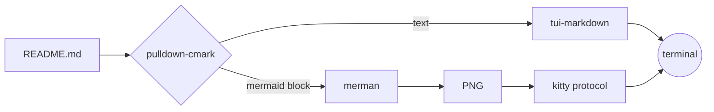
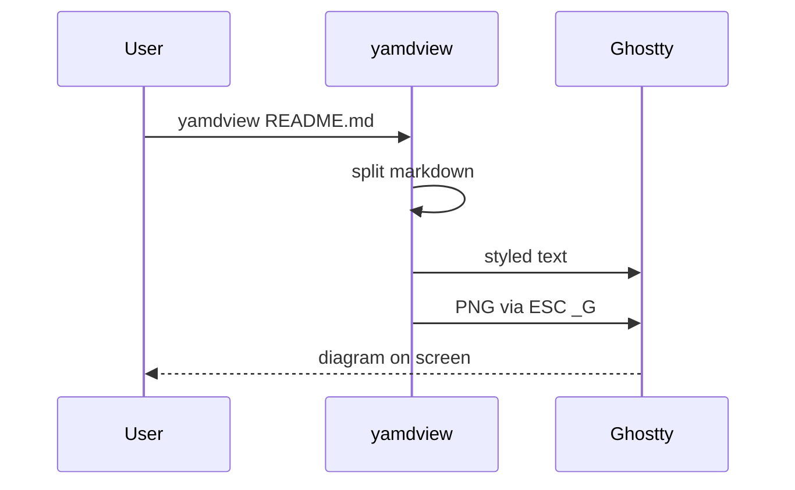

# yamdview

[](https://github.com/jordandelbar/yamdview/actions/workflows/ci.yml)

Render markdown in the terminal, with mermaid diagrams drawn as images
(kitty graphics protocol: Ghostty, kitty, WezTerm). No browser involved:
diagrams go through [merman](https://github.com/Latias94/merman).

```sh
cargo run --release -- README.md
```

A live viewer: it re-renders when the file is saved or the pane is resized,
so run it in a split next to your editor.

Colors and font come from `~/.config/yamdview/theme`: one `role = #rrggbb`
line per role (`background`, `foreground`, `selection`, `muted`, `heading`,
`bold`, `italic`, `code`, `link`, `quote`, `comment`, `keyword`, `string`,
`function`, `type`, `number`, `parameter`, `accent`, `note`, `info`,
`success`, `warning`, `error`) plus `font-family = Name`. Without that file
they come from Ghostty (`ghostty +show-config`), else Dracula.

Keys: `j`/`k` or arrows, `space`/`b` page, `ctrl-d`/`ctrl-u` half page,
`g`/`G` top/bottom, `q` to quit.

Search: `/` opens a prompt and searches as you type. `Enter` keeps the search,
`n`/`N` jump to the next/previous match (wrapping at the ends), and `Esc`
clears it. Matches are highlighted, with a match counter on the bottom line.
While typing, `Esc` cancels and returns to where the search started. After
scrolling, reloading, or resizing, `n`/`N` search beyond the current top row.
Search is literal and case-sensitive, within each displayed line of text;
diagram images are not searchable.

The mouse wheel scrolls the document, including inside tmux. In tmux, drag
with the left button to highlight visible text; releasing copies it to tmux's
paste buffer without entering copy mode. Paste with tmux's usual `prefix ]`.
The viewer also asks tmux to forward the text to the terminal clipboard;
clipboard support depends on your terminal and tmux configuration. Diagram
image placeholders are excluded from copied text. Scrolling, typing, resizing,
or reloading clears the selection.

Enable tmux mouse support with `set -g mouse on` in `~/.tmux.conf`.
No custom mouse bindings are needed with tmux's default bindings.
See [tmux mouse support](https://github.com/tmux/tmux/wiki/Getting-Started#using-the-mouse).

Mouse capture is enabled by default; `yamdview --no-mouse FILE.md` disables
it, and `--mouse` explicitly enables it. Outside tmux, use your terminal's
selection modifier (usually Shift) while dragging to copy text.

## How it works



## A sequence diagram



Other code blocks stay as code:

```rust
fn main() { println!("hi"); }
```
