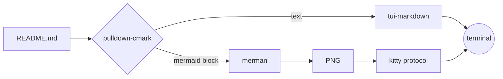
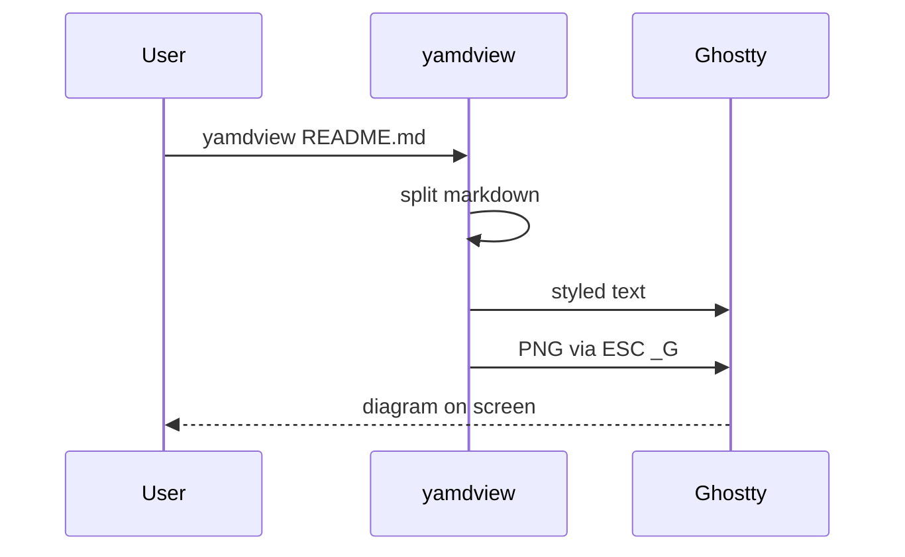

# yamdview

Render markdown in the terminal, with mermaid diagrams drawn as images
(kitty graphics protocol: Ghostty, kitty, WezTerm). No browser involved:
diagrams go through [merman](https://github.com/Latias94/merman).

```sh
cargo run --release -- README.md
```

A live viewer: it re-renders when the file is saved or the pane is resized,
so run it in a split next to your editor. Diagrams pick up Ghostty's colors
and font (`ghostty +show-config`).

Keys: `j`/`k` or arrows, `space`/`b` page, `ctrl-d`/`ctrl-u` half page,
`g`/`G` top/bottom, mouse wheel, `q` to quit.

## How it works



## A sequence diagram



Other code blocks stay as code:

```rust
fn main() { println!("hi"); }
```
