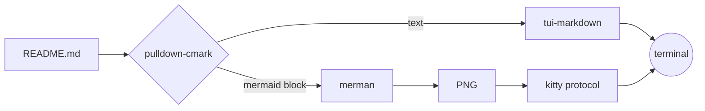
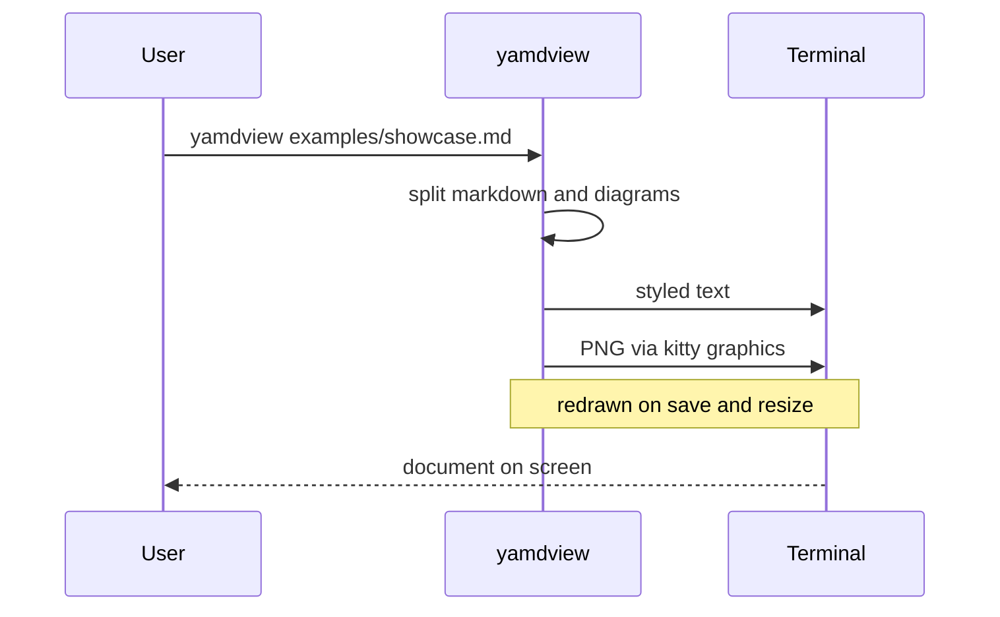
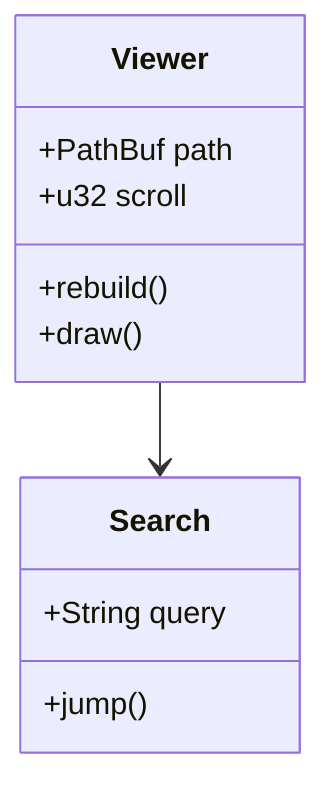
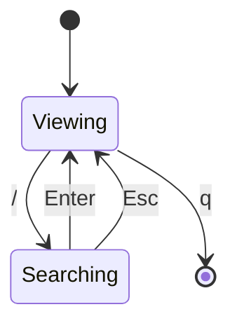
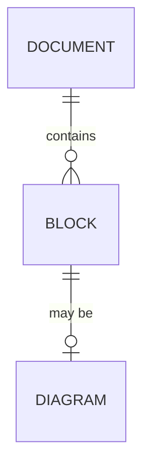
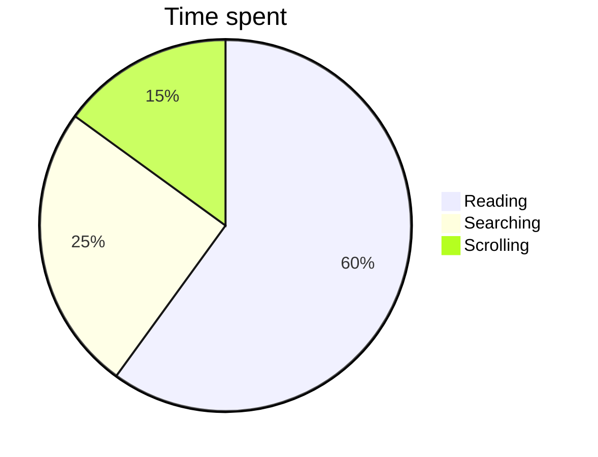
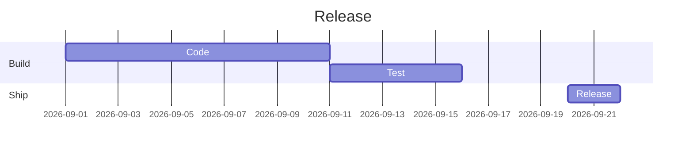

# Showcase

Run `cargo run -- examples/showcase.md` (or `yamdview examples/showcase.md`) to
see what yamdview draws.

## Text

Plain text with **bold**, _italic_, `inline code` and a
[link](https://github.com/jordandelbar/yamdview).

- A bullet list
- with two items

1. A numbered list
2. with two items

- [ ] A check
- [x] list

> A quote.

> [!NOTE]
> An alert, colored by the `info` theme role.

> [!WARNING]
> Another one, colored by `warning`.

| Column | Another column |
| ------ | -------------- |
| a      | b              |
| c      | d              |

---

## Code

```rust
fn main() {
    let name = "yamdview";
    println!("hello from {name}");
}
```

```sh
yamdview --no-mouse examples/showcase.md
```

## Flowchart



## Sequence diagram



## Class diagram



## State diagram



## Entity relationship diagram



## Pie chart



## Gantt chart


